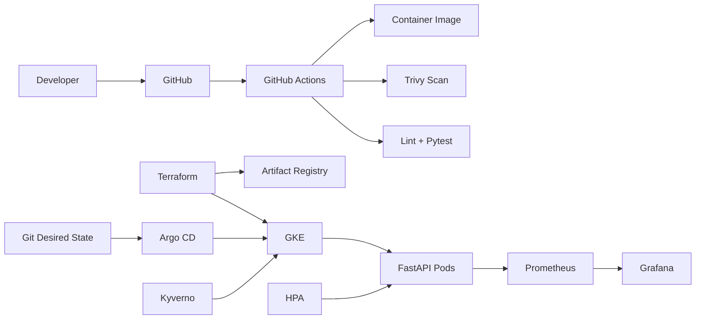

# Cloud-Native DevOps & SRE Platform

A standalone, production-style DevOps portfolio project built to demonstrate the lifecycle a DevOps/SRE engineer owns: **application → CI → secure container → infrastructure as code → Kubernetes → GitOps → autoscaling → observability → incident response**.

## Why this is not a basic DevOps demo

This repository is designed as an interview project, not a collection of disconnected YAML examples. It includes a real API workload, automated tests, container hardening, infrastructure provisioning, Kubernetes reliability controls, GitOps reconciliation, policy-as-code, metrics, load generation, and operational runbooks.

## Architecture



## Engineering features

- FastAPI service with health, readiness, metrics and controllable workload endpoints
- Non-root Docker container and read-only Kubernetes filesystem
- Kubernetes Deployment, Service, HPA, PDB and NetworkPolicy
- Kustomize development/production overlays
- Terraform-managed GKE and Artifact Registry
- Workload Identity enabled on GKE
- Argo CD automated sync, prune and self-heal
- GitHub Actions lint/test/container/security pipeline
- Terraform validation workflow
- Trivy HIGH/CRITICAL vulnerability gate
- Prometheus + Grafana local observability stack
- Kyverno policy-as-code example
- Load generation script for scaling/metrics demos
- Incident-response runbook and interview walkthrough

## Repository structure

```text
app/                  application workload
.github/workflows/    CI and Terraform validation
argocd/               GitOps application definition
k8s/                  Kubernetes base + environment overlays
terraform/            GCP/GKE infrastructure as code
observability/        Prometheus/Grafana configuration
policies/             policy-as-code
runbooks/             incident response
scripts/              operational utilities
tests/                automated application tests
```

## Run locally

```bash
git clone https://github.com/Jashwanth248/Devops-.git
cd Devops-
python -m venv .venv
source .venv/bin/activate
pip install -r requirements-dev.txt
pytest -q
uvicorn app.main:app --reload --port 8080
```

Open:
- API docs: `http://localhost:8080/docs`
- Health: `http://localhost:8080/healthz`
- Metrics: `http://localhost:8080/metrics`

## Run the observability stack

```bash
docker compose up --build
```

Then open:
- API: `http://localhost:8080`
- Prometheus: `http://localhost:9090`
- Grafana: `http://localhost:3000`

Generate traffic:

```bash
./scripts/load_test.sh
```

## Provision GCP infrastructure

```bash
cd terraform
terraform init
terraform plan -var="project_id=YOUR_GCP_PROJECT_ID"
terraform apply -var="project_id=YOUR_GCP_PROJECT_ID"
```

Cloud resources can incur charges. Destroy lab infrastructure when finished:

```bash
terraform destroy -var="project_id=YOUR_GCP_PROJECT_ID"
```

## Kubernetes / GitOps demo

1. Build and publish your container image.
2. Replace `REPLACE_ME` in `k8s/base/deployment.yaml` and `argocd/application.yaml`.
3. Provision GKE with Terraform.
4. Install Argo CD in the cluster.
5. Apply `argocd/application.yaml`.
6. Change a manifest in Git and show Argo CD automatically reconciling the cluster.
7. Run `scripts/load_test.sh` and observe metrics/autoscaling.

## What to explain in an interview

- Why GitOps is safer than giving CI unrestricted cluster credentials.
- Difference between pod autoscaling and node autoscaling.
- Why readiness and liveness probes solve different failure modes.
- Why PDBs matter during voluntary disruptions.
- Why requests/limits matter for scheduling and HPA behavior.
- How NetworkPolicy, hardened security contexts, image scanning and policy-as-code create defense in depth.
- How Prometheus metrics, SLOs and runbooks reduce mean time to recovery.

See [`docs/INTERVIEW.md`](docs/INTERVIEW.md) for a concise walkthrough.

## Resume bullet

> Engineered a production-style cloud-native delivery platform using GitHub Actions, Docker, Terraform, GKE, Argo CD, Kustomize, Prometheus/Grafana, autoscaling and policy-as-code, with automated tests, vulnerability scanning, hardened Kubernetes workloads and incident runbooks.
