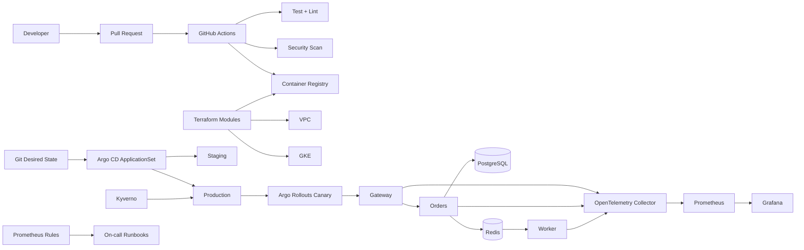

# PulseCart Production Platform

A company-style DevOps/SRE portfolio project that operates a small e-commerce platform the way a real platform team would: multiple services, isolated environments, GitOps delivery, progressive rollout, infrastructure as code, policy enforcement, observability, SLOs, incident response, and recovery drills.

> The application is deliberately small. The engineering value is in how the platform is provisioned, released, secured, observed, scaled, and recovered.

## Business workload

PulseCart is a fictional commerce company with three workloads:

- **gateway** — public customer API
- **orders** — internal order service
- **worker** — background processor

PostgreSQL stores orders and Redis decouples asynchronous work.

## Architecture



## Platform capabilities

### Delivery
- PR validation and immutable container builds
- GitOps deployment through Argo CD
- separate staging and production configuration
- Argo Rollouts canary releases with metric analysis

### Infrastructure
- Terraform module layout for network, GKE, registry and environments
- Workload Identity / short-lived cloud identity design
- environment isolation to reduce blast radius

### Reliability
- health/readiness probes
- resource requests and limits
- HPA and PodDisruptionBudget
- SLOs and error-budget thinking
- Prometheus alert rules
- incident runbooks and failure drills

### Observability
- OpenTelemetry Collector
- Prometheus metrics
- Grafana-ready dashboards
- centralized telemetry path for metrics/traces/logs

### Security
- non-root containers
- read-only root filesystems
- dropped Linux capabilities
- NetworkPolicy
- Kyverno policy-as-code
- vulnerability scanning
- least-privilege service accounts

## Repository structure

```text
services/                     gateway, orders, worker
platform/helm/               reusable service chart
environments/                staging and production values
gitops/                      Argo CD ApplicationSet
progressive-delivery/        canary rollout + analysis
terraform/modules/           reusable infrastructure modules
terraform/environments/      staging/prod compositions
observability/               OTel + Prometheus + SLOs
policies/                    cluster policy-as-code
runbooks/                    incident procedures
scripts/                     smoke tests and failure drills
docs/                        architecture + interview narrative
.github/workflows/           CI and IaC validation
```

## Local demo

```bash
docker compose -f docker-compose.company.yml up --build
```

Then:

```bash
curl http://localhost:8080/healthz
curl http://localhost:8080/api/orders
```

## Production delivery flow

1. Developer opens a PR.
2. CI tests, lints and scans.
3. Merge produces an immutable image tag.
4. Environment configuration is updated in Git.
5. Argo CD reconciles staging.
6. Production promotion uses Argo Rollouts.
7. Prometheus analysis decides whether the canary continues or aborts.
8. Alerts and SLOs provide post-release feedback.

## Interview demo

A strong 10-minute demo is:

1. explain the workload and dependency graph;
2. show Terraform environment isolation;
3. explain why CI builds while GitOps deploys;
4. show the ApplicationSet;
5. walk through the production canary;
6. show OTel + Prometheus alerts;
7. run a failure drill;
8. use the runbook to diagnose and roll back.

See [`docs/INTERVIEW_STORY.md`](docs/INTERVIEW_STORY.md).

## Resume bullets

- Built a production-style Kubernetes platform for a multi-service commerce workload using Terraform, GKE, Helm, Argo CD and Argo Rollouts, with isolated staging/production environments and GitOps-based promotion.
- Implemented reliability controls including HPA, PDBs, probes, NetworkPolicies, SLOs, Prometheus alerting, OpenTelemetry telemetry pipelines and documented incident-response runbooks.
- Hardened delivery with immutable builds, vulnerability scanning, policy-as-code and OIDC-based cloud authentication to reduce reliance on long-lived credentials.

## Portfolio note

PulseCart is fictional. The repository demonstrates realistic company platform patterns without claiming it serves a real production business.